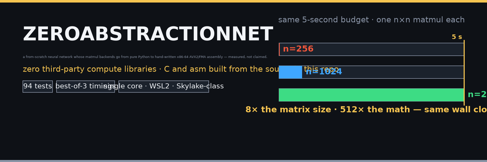
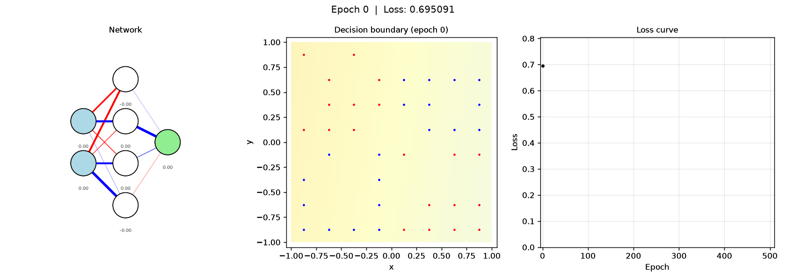

<p align="center">
  
</p>

<p align="center">
  <a href="docs/01_python_phase.md"></a>
  <a href="native/asm/matmul.asm"></a>
  <a href="tests/"></a>
  <a href="benchmark_matmul.py"></a>
  <a href="config.py"></a>
</p>

A from-scratch feedforward neural network trained on a tiny XOR-quadrant
dataset, whose matrix-multiplication backend is progressively replaced
**pure Python → C → hand-written x86-64 AVX2/FMA assembly** — every stage
built from the sources in this repo, and every speedup empirically measured,
not claimed.

<details>
<summary><b>tl;dr — the money lines</b></summary>

| | n=512 vs python | largest n in ~5 s |
|---|---|---|
| python | 1× | 256 |
| C blocked | 46× | 1024 |
| asm blocked (float32, handwritten) | ~237× | 2048 |

Same wall-clock budget, **8× the matrix size** — with zero third-party
compute libraries. The whole stack (matmul, activations, BCELoss,
backprop, the C brass, the NASM kernel) lives in this repo.

</details>

---

## Watch it run

Two presentation films built from the real sources — a drill-down through the
whole stack, and a fixed-budget matmul reel:

| The stack drill-down (30 s) | The 5-second budget reel |
|---|---|
| <video src="present/stack_drilldown.mp4" controls width="430" muted loop></video> | <video src="present/budget_reel.mp4" controls width="250" muted loop></video> |

| Frame | What it shows |
|---|---|
|  | the drill-down, title frame |
|  | the drill-down, pure-Python phase — highlighting the exact committed lines being executed |
|  | the drill-down, assembly phase — stage-C blocked FMA kernel, with the C grid kept filled behind it |
|  | budget reel, final state: python `n=256`, C `n=1024`, asm `n=2048` |

Both films are rendered by scripts in `present/` (`animate_stack.py`,
`animate_budget.py`) and **pixel-verified** by `present/verify_frames.py` —
they decode every frame and assert layout, colours, and per-phase content, so
the media can't silently rot.

---

## The training runs — one net, three backends

Same showcase network (`2,32,32,1`, 200 points, 250 epochs, lr 2.5),
rendered by the unchanged `animate.py` for every backend:

<video src="animations/showcase_python.mp4" controls width="440" muted loop></video>
<video src="animations/showcase_c.mp4" controls width="440" muted loop></video>
<video src="animations/showcase_asm.mp4" controls width="440" muted loop></video>

The cross-backend matmul comparison — all six variants (python-naive,
c-naive, c-blocked, asm-scalar, asm-vectorized, asm-blocked), animated
staging into the log-scale sweep, then its static final state:

<video src="animations/backend_comparison.mp4" controls width="600" muted loop></video>


### The classic GIFs

| | |
|---|---|
|  | the demo-tier training loop — network diagram, decision boundary, loss curve, per-epoch phase times |
|  | a 1-hidden-layer demo run |
|  | the dataset generator placing 25 jittered points per quadrant (`data/animate_data_generation.py`) |

---

## How the stack works

```
          train.py / animate.py / benchmark_matmul.py / compare_backends.py
                                      |
                    ops/  backend abstraction (matmul · add · transpose · elementwise)
                   /          |           \
   backend_python.py   backend_c.py   backend_asm.py
        (pure)          (ctypes)      (ctypes, float32)
                           |               |
                     native/c/matmul.c   native/asm/matmul.asm
                     (blocked, C99)      (scalar → vectorized → blocked, AVX2/FMA)
```

- **Phase 1 — pure Python** (`ops/backend_python.py`): the reference matmul.
  A phase-1 `cProfile` run showed **82% of wall time inside `matmul`**
  (1.716 s tottime of 2.080 s total; forward 34.5% / backward 65.1% /
  update 0.4%) — that's why matmul is the thing to replace. See
  [docs/01_python_phase.md](docs/01_python_phase.md).
- **Phase 2 — C** (`native/c/matmul.c` + `ops/backend_c.py`): a cache-blocked
  kernel (`BLOCK_SIZE 96`) exposed through ctypes, `gcc -O2`. See
  [docs/02_c_phase.md](docs/02_c_phase.md).
- **Phase 3 — assembly** (`native/asm/matmul.asm` + `ops/backend_asm.py`):
  three staged kernels — **A** scalar ABI-progression baseline, **B**
  vectorized (`vfmadd231ps`), **C** cache-blocked FMA. The intended float32
  precision downgrade doubles the SIMD lanes. See
  [docs/03_asm_phase.md](docs/03_asm_phase.md).

---

## The numbers

### Fixed budget — same ~5 s, 8× the matrix

| phase | backend (fastest config) | largest n in ~5 s | world time at that n |
|---|---|---|---|
| 1 | python | 256 | 2.64 s |
| 2 | C blocked | 1024 | 3.11 s |
| 3 | asm blocked (float32) | 2048 | 4.96 s |

### The full matmul sweep (seconds, best-of-3)

| size | python-naive | c-naive | c-blocked | asm-scalar | asm-vectorized | asm-blocked |
|---|---|---|---|---|---|---|
| 16 | 0.000259 | 0.000171 | 0.000177 | 0.000135 | 6e-05 | 6.2e-05 |
| 32 | 0.002481 | 0.001109 | 0.001159 | 0.000388 | 0.000193 | 0.000191 |
| 64 | 0.0526 | 0.002968 | 0.003822 | 0.001316 | 0.000909 | 0.001252 |
| 128 | 0.2818 | 0.02135 | 0.03079 | 0.007025 | 0.003511 | 0.003319 |
| 256 | 2.637 | 0.1551 | 0.09788 | 0.1401 | 0.02208 | 0.01915 |
| 512 | 26.11 | 1.326 | 0.5725 | 0.8098 | 0.107 | 0.1103 |
| 1024 | - | 16.37 | 3.112 | 15.24 | 2.431 | 0.6884 |
| 2048 | - | - | 18.52 | - | 24.09 | 4.963 |

Speedups vs python-naive at n=512: **c-naive 20×, c-blocked 46×,
asm-blocked ~237×**. asm-blocked vs c-blocked: **4.5× at n=1024, 3.7× at
n=2048** — the float32 extra-SIMD-lanes win is visible, and the
cache-blocked final stage is the consistent fastest config from n=256 up.
The asm progression to watch at n=1024: scalar 15.24 s → vectorized
2.431 s → blocked 0.6884 s.

### Shaped matmul — the shapes the showcase net actually uses (seconds)

| shape | python | c | asm |
|---|---|---|---|
| 200x1x32 | 0.0012633 | 0.00035385 | 0.0002147 |
| 200x2x32 | 0.0028662 | 0.00043437 | 0.00023554 |
| 200x32x1 | 0.00040141 | 0.00081654 | 0.00081915 |
| 200x32x2 | 0.00091226 | 0.0010581 | 0.00058381 |
| 200x32x32 | 0.013995 | 0.0011168 | 0.00081058 |

### Showcase tier per epoch (2,32,32,1 · n=200 · 250 epochs · lr 2.5)

| backend | epoch (ms) | fwd % | bwd % | upd % | speedup vs python | final loss | golden ok |
|---|---|---|---|---|---|---|---|
| python | 81.0 | 35.1 | 64.6 | 0.3 | 1.0× | 0.016710 | yes |
| c | 20.9 | 36.1 | 63.0 | 0.9 | 3.9× | 0.016710 | yes |
| asm | 19.5 | 37.2 | 61.8 | 1.0 | 4.1× | 0.018767 | yes |

The tiny-net numbers look flat because the network's matmuls are only 32×32
and the frozen pure-Python elementwise/marshalling overhead dominates on
this tier — the payoff lives in the matrix-level sweep above. Final loss
parity is held: asm's slightly higher loss is the intended per-phase
float32 precision downgrade, and the golden points still classify in all
three backends.

Full detail: [RESULTS.md](RESULTS.md) (profiling evidence, sweep notes,
artifacts) and [benchmark_report.md](benchmark_report.md) (raw CSV values,
generated by `compare_backends.py`).

> **Measurement card** — these numbers only hold in context: Intel
> Skylake-class, single core, WSL2 Ubuntu 24.04; `gcc -O2` for the C
> backends, NASM + `gcc -shared` for the assembly; best-of-3 timings; asm
> uses float32 (AVX2/FMA, the intended phase-3 precision downgrade). No
> `-march`, no `-ffast-math`, no BLAS/numpy compute — rerun everything with
> `benchmark_matmul.py` and `compare_backends.py`.

---

## Dataset — XOR quadrants

A synthetic 2D binary classification problem with 4 golden test points that
are trivial to verify by eye:

| Point | Label | Quadrant |
|---|---|---|
| ( 0.5,  0.5) | 1 | I   |
| (-0.5, -0.5) | 1 | III |
| ( 0.5, -0.5) | 0 | II  |
| (-0.5,  0.5) | 0 | IV  |

**Rule:** label = 1 iff `x * y > 0` (quadrants I & III), else 0 (II & IV).
Points on the axes (`x == 0` or `y == 0`) are never generated.

Key properties:

- **Deterministic** — seeded RNG, same seed = same dataset every time.
- **Balanced** — exactly `n_per_quadrant` points per quadrant (default 25 → 100 total, 50 per class).
- **Jittered grid layout** — points sit on a uniform grid within each quadrant with small random jitter, not pure scatter, ensuring even visual coverage for the animation heatmap.
- **Noise knob** — `noise_std` (default 0.0) adds Gaussian jitter that can flip labels near axes; the core demo always uses 0.0.
- **Probe grid** — a separate uniform `resolution × resolution` grid over [-1, 1]² (default 40 → 1600 points) used only for the decision-boundary heatmap, never for training.

The generator lives in `data/generate_data.py` — the single source of all
dataset loading for every phase.

## Two tiers of runs — demo vs showcase

Every tool in this repo must keep working at **both** scales. The
distinction is load-bearing and applies to every phase:

| | Demo tier (default) | Showcase tier (efficiency) |
|---|---|---|
| Architecture | `[2, 4, 4, 1]` (config default) | `--layers 2,32,32,1` |
| Dataset | 100 points (`--n-per-quadrant 25`) | 200 points (`--n-per-quadrant 50`) |
| Run | `--epochs 250 --lr 2.5` | same flags |
| Purpose | pedagogy — readable boundary, golden points, loss curve, 3-panel animation | making the C/asm speedups visible and measurable |
| Typical epoch (pure Python) | ~5 ms | ~160 ms |

**Why two tiers:** a native call carries ~1-5 µs of ctypes marshalling
overhead; at demo scale an entire epoch is only ~2-10 ms, so a native
backend looks equal there and the project's headline feature would be
invisible. At showcase scale compute dwarfs marshalling and the speedup
becomes real, measurable, and visible — per-epoch phase times in the
animation's 4th panel, the shaped-matmul table in `analyze_run.py`,
`compare_backends.py`'s comparison table, and the animated sweep plot.

**Rules:**

- Never change `config.py` defaults to showcase scale — the tiny demo is the pedagogy artifact.
- Correctness checks (golden points, cross-backend loss parity) run at demo tier; efficiency checks (speedups, benchmark tables) run at showcase tier.
- At showcase scale `animate.py` draws only the top ~300 weights per layer by magnitude, keeping the diagram readable.

---

## Run it yourself

```bash
# build the native backends (needs a Linux/WSL2 box with gcc + NASM)
make -C native/c
make -C native/asm

# correctness — all suites (the c/asm suites need the builds above)
python -m pytest tests/

# train + animate — demo tier is the default, showcase tier is explicit flags
python train.py --backend asm --epochs 250 --lr 2.5
python train.py --layers 2,32,32,1 --n-per-quadrant 50 --epochs 250 --lr 2.5 --log-every 5 --log-dir logs/showcase_asm
python animate.py --log-dir logs/showcase_asm --out animations/showcase_asm.mp4

# benchmark + compare (best-of-3; appends to benchmark_results.csv / benchmark_shaped.csv)
python benchmark_matmul.py --backend asm --variant blocked --sizes 16,32,64,128,256,512 --repeats 3
python compare_backends.py

# reproduce every presentation asset, then pixel-verify it
python data/animate_data_generation.py --save animations/dataset_generation.gif
python present/animate_budget.py
python present/animate_stack.py
python present/banner.py
python present/verify_frames.py                          # budget reel + banner
python present/verify_frames.py --spec stack --mp4 present/stack_drilldown.mp4
```

## Repo layout

```
ZeroAbstractionNet/
├── ops/                      backend abstraction — matmul · add · transpose · elementwise
│   ├── backend_python.py     phase-1 reference: pure-Python triple loop
│   ├── backend_c.py          ctypes bridge into native/c
│   └── backend_asm.py        ctypes bridge into native/asm (float32)
├── native/
│   ├── c/                    matmul.h · matmul.c · Makefile     (blocked, BLOCK_SIZE 96)
│   └── asm/                  matmul.asm · Makefile              (scalar → vectorized → blocked)
├── tests/                    test_ops_{python,c,asm}.py · test_forward_backward.py
├── data/
│   ├── generate_data.py                single source of truth for the dataset
│   └── animate_data_generation.py      renders animations/dataset_generation.gif
├── present/                  animate_budget.py · animate_stack.py · banner.py ·
│                             verify_frames.py + the rendered media
├── animations/               every rendered asset (training runs, GIFs, sweep plot)
├── train.py · animate.py · benchmark_matmul.py · compare_backends.py ·
├── analyze_run.py · profile_run.py
├── config.py                 demo-tier defaults ([2,4,4,1] · lr 2.5 · seed 0 · 25/quadrant)
├── RESULTS.md · benchmark_report.md · plan.md
└── docs/                     01_python_phase · 02_c_phase · 03_asm_phase
```

## Testing & correctness

- Golden 2×2 matmul case: c and asm agree with phase-1 maths to the
  appropriate tolerance (tight for c, relative for asm due to float32 +
  SIMD reduction ordering).
- Randomized property tests over many shapes, including the
  non-multiple-of-8 `k` (asm remainder path) and non-multiple-of-block
  `n`/`m` boundary sizes.
- Full pipelines: `train.py --backend {python,c,asm}` all converge and the
  4 golden points classify correctly in every backend.
- All **94 tests pass** on the benchmark box (WSL2, native builds in place).

---

## Docs

- [Phase 1 — Pure Python](docs/01_python_phase.md)
- [Phase 2 — C Backend](docs/02_c_phase.md)
- [Phase 3 — Assembly Backend](docs/03_asm_phase.md)
- [Results](RESULTS.md) — profiling evidence, capacity, sweep, artifacts
- [Benchmark report](benchmark_report.md) — raw per-variant CSV values
- [Plan](plan.md) — the exercise as it was specified
