<div align="center">
<pre>
                  _____   __________  ____ 
                 /__  /  / ____/ __ \/ __ \
                   / /  / __/ / /_/ / / / /
                  / /__/ /___/ _, _/ /_/ / 
                 /____/_____/_/ |_|\____/  
      ___    ____ _______________  ___   ________________
     /   |  / __ ) ___/_  __/ __ \/   | / ____/_  __/  _/
    / /| | / __  \__ \ / / / /_/ / /| |/ /     / /  / /  
   / ___ |/ /_/ /__/ // / / _, _/ ___ / /___  / / _/ /   
  /_/  |_/_____/____//_/ /_/ |_/_/  |_\____/ /_/ /___/   
               ____  _   __   _   ______________
              / __ \/ | / /  / | / / ____/_  __/
             / / / /  |/ /  /  |/ / __/   / /   
            / /_/ / /|  /  / /|  / /___  / /    
            \____/_/ |_/  /_/ |_/_____/ /_/     
</pre>
</div>

<p align="center">
<em>a from-scratch neural network — pure Python → C → hand-written x86-64 AVX2/FMA assembly<br>measured, not claimed · zero third-party compute libraries</em>
</p>

<p align="center">
  
  
  
  
  
</p>

---

## What this is

A tiny feedforward network that learns XOR — and the excuse to write a
matmul **three times** with progressively less abstraction between you and
the silicon. Every backend is built from the sources in this repo; every
speedup is measured on the same box, best-of-3.

```
         x₁, x₂
            │
        ┌───▼───┐   w₁ · 2×4
        │  [2]  │
        └───┬───┘
            ▼  σ
        ┌───▼───┐   w₂ · 4×4
        │  [4]  │
        └───┬───┘
            ▼  σ
        ┌───▼───┐   w₃ · 4×1
        │  [4]  │
        └───┬───┘
            ▼
        ┌───▼───┐
        │  [1]  │──► ŷ
        └───────┘

   loss = BCELoss(ŷ, y) · lr 2.5 · seed 0 · demo tier [2,4,4,1]
```

The architecture above is the **demo tier**; the benchmark showcase uses
`[2,32,32,1]` (see [two tiers](#two-tiers--demo-vs-showcase)).

And this is the function every phase is really optimizing:

```
        A × B = C             n×n float32 · cache-blocked · FMA
      ⎡ · · · ⎤   ⎡ · · · ⎤     ⎡ · · · ⎤
      ⎢ · · · ⎥ × ⎢ · · · ⎥  =  ⎢ · · · ⎥
      ⎣ · · · ⎦   ⎣ · · · ⎦     ⎣ · · · ⎦
```

A phase-1 `cProfile` run showed **82% of wall time inside `matmul`** — so
that's the one function worth hand-writing in assembly:

```
  where phase-1 wall time goes (cProfile · 5 epochs · pure Python):
  matmul     ████████████████████  82%    (1.716 s of 2.080 s)
  forward    ████████  34.5%
  backward   ████████████████  65.1%
  update     ▏  0.4%
```

---

## The films

### 1 · The stack drill-down — from Python to registers

One 8×8 matmul, executed through the whole stack — pure-Python loop,
ctypes marshalling, the C kernel, and the hand-written assembly — with the
**exact committed source lines** highlighted as they run.

<p align="center">
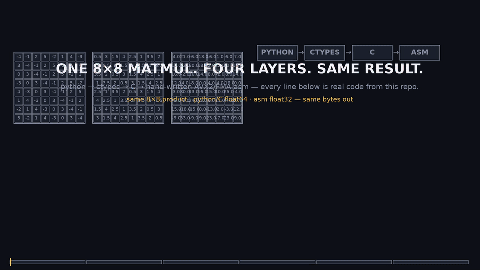
</p>
<p align="center"><sub>30 s · the line-by-line walk is drawn from the real files in <code>ops/</code> and <code>native/</code> · <a href="present/stack_drilldown.mp4">full-res mp4 (1920×1080)</a></sub></p>

| the storyboard | |
|---|---|
| 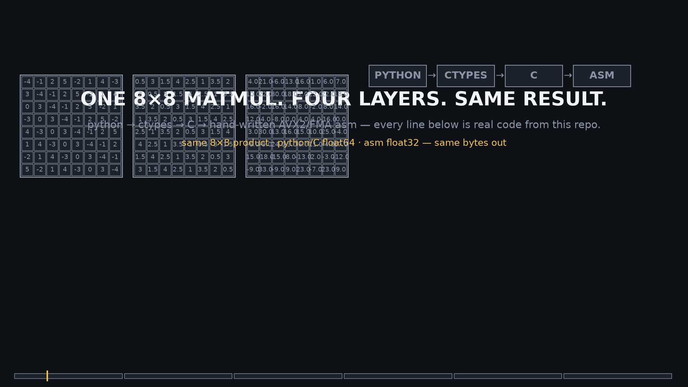 | the title frame — the four layers of the stack |
| 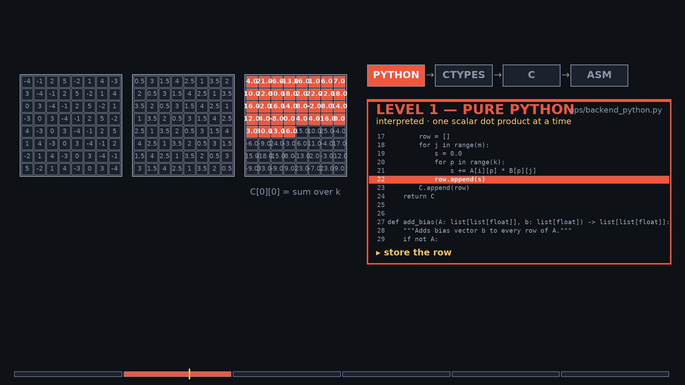 | the pure-Python phase — the reference triple loop runs, filling the C matrix one cell at a time |
| 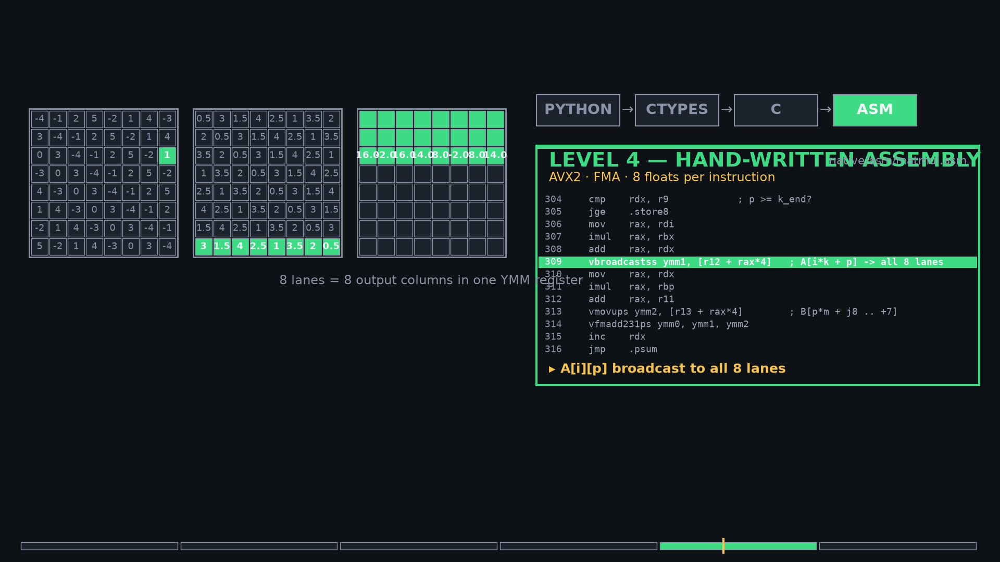 | the assembly phase — the stage-C blocked FMA kernel, with the C grid kept filled behind it |

The film (and everything in `present/`) is rendered by `animate_stack.py`
and then **pixel-verified** by `verify_frames.py`, which decodes every
frame and asserts canvas, colours, and per-phase content — the media can't
silently rot.

### 2 · The 5-second budget reel

Same wall clock, three backends, three very different matrix sizes.

<p align="center">
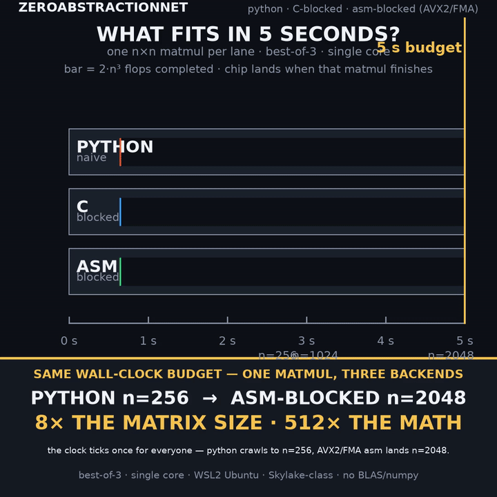
</p>
<p align="center"><sub>17 s · each chip lands when its n×n matmul actually finishes · <a href="present/budget_reel.mp4">full-res mp4 (1080×1080)</a></sub></p>

```
  ~5 s budget · one n×n matmul · best-of-3:
  python ████████████████████████████                        n=256   2.64 s
  c      █████████████████████████████████                   n=1024  3.11 s
  asm    ████████████████████████████████████████████████████ n=2048  4.96 s

  same 5 seconds · 8× the matrix size · 512× the math
```

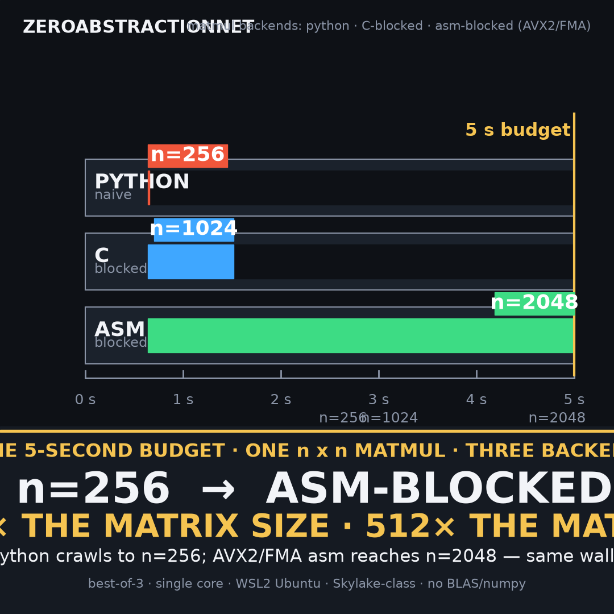

### 3 · One network, three backends

The exact same showcase net (`2,32,32,1` · 200 points · 250 epochs · lr
2.5), trained and rendered by the unchanged `animate.py` for every
backend — network diagram, decision boundary, loss curve, per-epoch phase
times.

<p align="center">
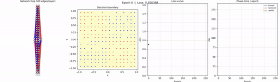
</p>
<p align="center"><sub>pure Python — 81.0 ms/epoch · 1.0× · <a href="animations/showcase_python.mp4">full-res mp4</a></sub></p>

<p align="center">
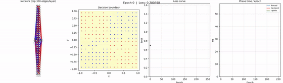
</p>
<p align="center"><sub>C (blocked, ctypes) — 20.9 ms/epoch · 3.9× · <a href="animations/showcase_c.mp4">full-res mp4</a></sub></p>

<p align="center">
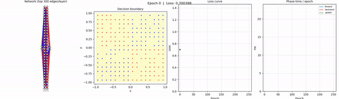
</p>
<p align="center"><sub>x86-64 asm (AVX2/FMA, float32) — 19.5 ms/epoch · 4.1× · <a href="animations/showcase_asm.mp4">full-res mp4</a></sub></p>

### 4 · The cross-backend sweep

All six variants — python-naive, c-naive, c-blocked, asm-scalar,
asm-vectorized, asm-blocked — staged into the log-log sweep, plus its
static final state.

<p align="center">
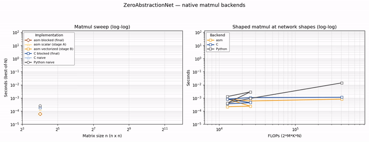
</p>
<p align="center"><sub>animated staging, then the full final state · <a href="animations/backend_comparison.mp4">full-res mp4</a></sub></p>

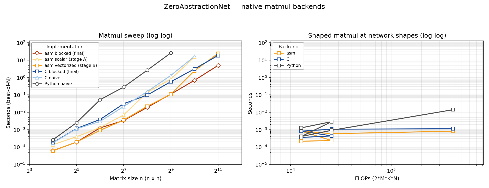

### 5 · The classic demo runs

Before the showcase existed, there were these — the tiny demo net
`[2,4,4,1]`, 250 epochs, lr 2.5, one loop per backend. Same seed, same
loss curve, three different engines underneath:

<p align="center">

</p>
<p align="center"><sub>pure Python — the demo net at work: diagram, decision boundary, loss curve, per-epoch phase times</sub></p>

<p align="center">
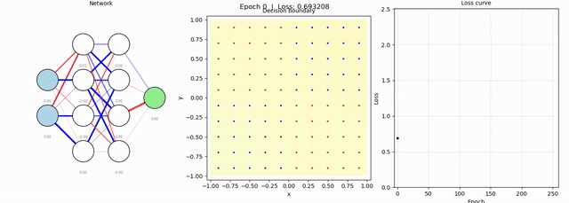
</p>
<p align="center"><sub>C backend — the same run, the same seed, a faster matmul under the hood</sub></p>

<p align="center">
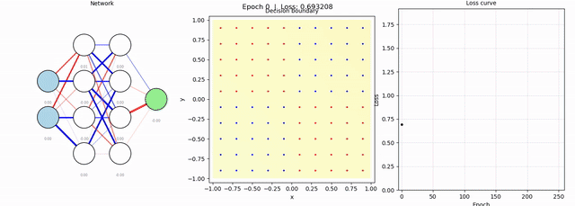
</p>
<p align="center"><sub>x86-64 assembly — the same run again, the fastest matmul of the three</sub></p>

And the one that started it all:

<p align="center">
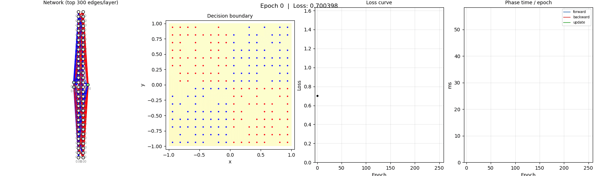
</p>
<p align="center"><sub>the original phase-1 loop — the GIF that grew this whole repo</sub></p>

---

## How the stack works

```
          train.py · animate.py · benchmark_matmul.py · compare_backends.py
                                        │
                       ops/  matmul · add · transpose · elementwise
                     ┌──────────────┬──────────────┐
                     │              │              │
            backend_python.py  backend_c.py   backend_asm.py     (ctypes)
                     │              │              │
                pure loops     matmul.c       matmul.asm
                             (C99, blocked)  (scalar → vectorized → blocked,
                                              float32 · AVX2/FMA)
```

- **Phase 1 — pure Python** — `ops/backend_python.py` is the reference
  matmul every later backend must match. [docs/01_python_phase.md](docs/01_python_phase.md)
- **Phase 2 — C** — `native/c/matmul.c` (cache-blocked, `BLOCK_SIZE 96`,
  `gcc -O2`) bridged through `ops/backend_c.py`. [docs/02_c_phase.md](docs/02_c_phase.md)
- **Phase 3 — assembly** — `native/asm/matmul.asm` in three staged kernels:
  **A** scalar (ABI-progression baseline), **B** vectorized (`vfmadd231ps`),
  **C** cache-blocked FMA. The intended float32 downgrade doubles the SIMD
  lanes. [docs/03_asm_phase.md](docs/03_asm_phase.md)

---

## The numbers

The money lines first:

| | n=512 vs python | largest n in ~5 s |
|---|---|---|
| python | 1× | 256 |
| C blocked | 46× | 1024 |
| asm blocked (float32, handwritten) | **~237×** | **2048** |

Same wall-clock budget, **8× the matrix size**. The full story, from the
smallest shape up:

### The full matmul sweep — seconds, best-of-3

| size | python-naive | c-naive | c-blocked | asm-scalar | asm-vectorized | asm-blocked |
|---|---|---|---|---|---|---|
| 16 | 0.000259 | 0.000171 | 0.000177 | 0.000135 | 6e-05 | 6.2e-05 |
| 32 | 0.002481 | 0.001109 | 0.001159 | 0.000388 | 0.000193 | 0.000191 |
| 64 | 0.0526 | 0.002968 | 0.003822 | 0.001316 | 0.000909 | 0.001252 |
| 128 | 0.2818 | 0.02135 | 0.03079 | 0.007025 | 0.003511 | 0.003319 |
| 256 | 2.637 | 0.1551 | 0.09788 | 0.1401 | 0.02208 | 0.01915 |
| 512 | 26.11 | 1.326 | 0.5725 | 0.8098 | 0.107 | 0.1103 |
| 1024 | - | 16.37 | 3.112 | 15.24 | 2.431 | 0.6884 |
| 2048 | - | - | 18.52 | - | 24.09 | 4.963 |

Speedups vs python-naive at n=512: **c-naive 20× · c-blocked 46× ·
asm-blocked ~237×**. asm-blocked vs c-blocked: **4.5× at n=1024, 3.7× at
n=2048** — the float32 extra-lane win is visible, and the blocked final
stage is the consistent fastest config from n=256 up. The asm progression
to watch at n=1024: scalar 15.24 s → vectorized 2.431 s → blocked
0.6884 s.

<details>
<summary><b>The shaped sweep</b> — the matmuls the showcase net actually performs (seconds)</summary>

| shape | python | c | asm |
|---|---|---|---|
| 200x1x32 | 0.0012633 | 0.00035385 | 0.0002147 |
| 200x2x32 | 0.0028662 | 0.00043437 | 0.00023554 |
| 200x32x1 | 0.00040141 | 0.00081654 | 0.00081915 |
| 200x32x2 | 0.00091226 | 0.0010581 | 0.00058381 |
| 200x32x32 | 0.013995 | 0.0011168 | 0.00081058 |

</details>

<details>
<summary><b>The showcase run</b> — per epoch, 2,32,32,1 · n=200 · 250 epochs · lr 2.5</summary>

| backend | epoch (ms) | fwd % | bwd % | upd % | speedup vs python | final loss | golden ok |
|---|---|---|---|---|---|---|---|
| python | 81.0 | 35.1 | 64.6 | 0.3 | 1.0× | 0.016710 | yes |
| c | 20.9 | 36.1 | 63.0 | 0.9 | 3.9× | 0.016710 | yes |
| asm | 19.5 | 37.2 | 61.8 | 1.0 | 4.1× | 0.018767 | yes |

The tiny-net numbers look flat because its matmuls are only 32×32 and the
frozen pure-Python elementwise/marshalling overhead dominates on this
tier — the payoff lives in the matrix-level sweep above. Loss parity is
held: asm's slightly higher loss is the intended per-phase float32
precision downgrade; the golden points still classify in all three.

</details>

Full detail: [RESULTS.md](RESULTS.md) (profiling evidence, capacity, the
notes behind every table) and [benchmark_report.md](benchmark_report.md)
(the raw CSV values, generated by `compare_backends.py`).

> **Measurement card** — these numbers only hold in context: Intel
> Skylake-class, single core, WSL2 Ubuntu 24.04; `gcc -O2` for the C
> backends, NASM + `gcc -shared` for the assembly; best-of-3 timings; asm
> uses float32 (AVX2/FMA, the intended phase-3 precision downgrade). No
> `-march`, no `-ffast-math`, no BLAS/numpy compute — rerun everything with
> `benchmark_matmul.py` and `compare_backends.py`.

---

## The dataset — XOR quadrants

```
                    y
                    ▲
       (-0.5, 0.5)  │ (0.5, 0.5)
          •0        │     •1
           IV       │    I
     ───────────────┼──────────────► x
           III      │    II
          •0        │     •1
       (-0.5,-0.5)  │ (0.5,-0.5)
                    │
```

The four dots are the **golden points** — trivial to verify by eye:

| Point | Label | Quadrant |
|---|---|---|
| ( 0.5,  0.5) | 1 | I   |
| (-0.5, -0.5) | 1 | III |
| ( 0.5, -0.5) | 0 | II  |
| (-0.5,  0.5) | 0 | IV  |

**Rule:** label = 1 iff `x · y > 0` (quadrants I & III), else 0 (II & IV).
Points on the axes (`x == 0` or `y == 0`) are never generated.

- **Deterministic** — seeded RNG, same seed = same dataset every time.
- **Balanced** — exactly `n_per_quadrant` points per quadrant (default 25 → 100 total, 50 per class).
- **Jittered grid layout** — a uniform grid per quadrant with small random jitter, not pure scatter, so the heatmap covers the space evenly.
- **Noise knob** — `noise_std` (default 0.0) can flip labels near axes; the core demo always uses 0.0.
- **Probe grid** — a separate uniform `resolution × resolution` grid over [-1, 1]² (default 40 → 1600 points) for the decision-boundary heatmap only — never trained on.

`data/generate_data.py` is the single source of all dataset loading for
every phase. Watch it build the 100-point dataset, 25 seeded, jittered
points per quadrant:

<p align="center">
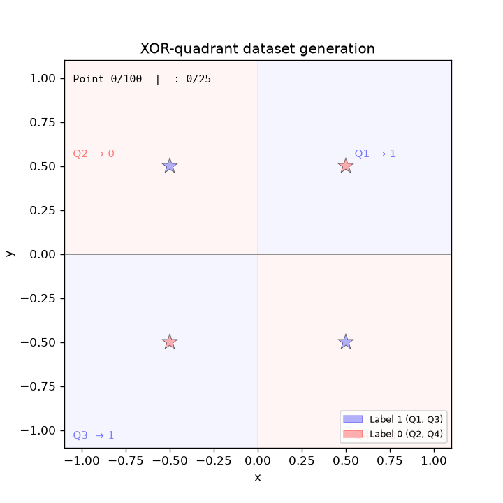
</p>
<p align="center"><sub>the generator at work — a uniform grid, a whisper of jitter, a deterministic seed</sub></p>

## Two tiers — demo vs showcase

Every tool in this repo must keep working at **both** scales — the
distinction is load-bearing and applies to every phase:

| | Demo tier (default) | Showcase tier (efficiency) |
|---|---|---|
| Architecture | `[2, 4, 4, 1]` (config default) | `--layers 2,32,32,1` |
| Dataset | 100 points (`--n-per-quadrant 25`) | 200 points (`--n-per-quadrant 50`) |
| Run | `--epochs 250 --lr 2.5` | same flags |
| Purpose | pedagogy — readable boundary, golden points, loss curve, 3-panel animation | making the C/asm speedups visible and measurable |
| Typical epoch (pure Python) | ~5 ms | ~160 ms |

**Why two tiers:** a native call carries ~1-5 µs of ctypes marshalling
overhead. At demo scale an entire epoch is only ~2-10 ms, so a native
backend looks equal there and the project's headline feature would be
invisible. At showcase scale compute dwarfs marshalling and the speedup
becomes real — per-epoch phase times in the animation's 4th panel, the
shaped table in `analyze_run.py`, the comparison table in
`compare_backends.py`, and the animated sweep plot.

**Rules:**

- Never change `config.py` defaults to showcase scale — the tiny demo is the pedagogy artifact.
- Correctness checks (golden points, cross-backend loss parity) run at demo tier; efficiency checks (speedups, benchmark tables) run at showcase tier.
- At showcase scale `animate.py` draws only the top ~300 weights per layer by magnitude, keeping the diagram readable.

---

## Train it yourself

```bash
# build the native backends (needs a Linux/WSL2 box with gcc + NASM)
make -C native/c
make -C native/asm
```

```bash
# correctness — all suites (the c/asm suites need the builds above)
python -m pytest tests/
```

```bash
# train + animate — demo tier is the default, showcase tier is explicit flags
python train.py --backend asm --epochs 250 --lr 2.5
python train.py --layers 2,32,32,1 --n-per-quadrant 50 --epochs 250 --lr 2.5 --log-every 5 --log-dir logs/showcase_asm
python animate.py --log-dir logs/showcase_asm --out animations/showcase_asm.mp4
```

```bash
# benchmark + compare (best-of-3; appends to benchmark_results.csv / benchmark_shaped.csv)
python benchmark_matmul.py --backend asm --variant blocked --sizes 16,32,64,128,256,512 --repeats 3
python compare_backends.py
```

```bash
# reproduce every presentation asset, then pixel-verify it
python data/animate_data_generation.py --save animations/dataset_generation.gif
python present/animate_budget.py
python present/animate_stack.py
python present/verify_frames.py                          # budget reel + banner
python present/verify_frames.py --spec stack --mp4 present/stack_drilldown.mp4
```

## Repo layout

```
ZeroAbstractionNet/
├── ops/                      backend abstraction — matmul · add · transpose · elementwise
│   ├── backend_python.py     phase-1 reference: pure-Python triple loop
│   ├── backend_c.py          ctypes bridge into native/c
│   └── backend_asm.py        ctypes bridge into native/asm (float32)
├── native/
│   ├── c/                    matmul.h · matmul.c · Makefile     (blocked, BLOCK_SIZE 96)
│   └── asm/                  matmul.asm · Makefile              (scalar → vectorized → blocked)
├── tests/                    test_ops_{python,c,asm}.py · test_forward_backward.py
├── data/
│   ├── generate_data.py                single source of truth for the dataset
│   └── animate_data_generation.py      renders animations/dataset_generation.gif
├── present/                  animate_budget.py · animate_stack.py · verify_frames.py
│                             + the rendered films and stills
├── animations/               every rendered asset (training runs, GIFs, sweep plot)
├── train.py · animate.py · benchmark_matmul.py · compare_backends.py ·
├── analyze_run.py · profile_run.py
├── config.py                 demo-tier defaults ([2,4,4,1] · lr 2.5 · seed 0 · 25/quadrant)
├── RESULTS.md · benchmark_report.md · plan.md
└── docs/                     01_python_phase · 02_c_phase · 03_asm_phase
```

## Testing — the suite that backprops

- Golden 2×2 matmul: c and asm agree with phase-1 maths to the
  appropriate tolerance (tight for c, relative for asm — float32 + SIMD
  reduction ordering).
- Randomized property tests over many shapes, including the
  non-multiple-of-8 `k` (asm remainder path) and non-multiple-of-block
  `n`/`m` boundary sizes.
- Full pipelines: `train.py --backend {python,c,asm}` all converge and the
  4 golden points classify correctly in every backend.
- **94 tests pass** on the benchmark box (WSL2, native builds in place).

---

## Docs

- [Phase 1 — Pure Python](docs/01_python_phase.md)
- [Phase 2 — C Backend](docs/02_c_phase.md)
- [Phase 3 — Assembly Backend](docs/03_asm_phase.md)
- [Results](RESULTS.md) — profiling evidence, capacity, sweep, artifacts
- [Benchmark report](benchmark_report.md) — raw per-variant CSV values
- [Plan](plan.md) — the exercise as it was specified
